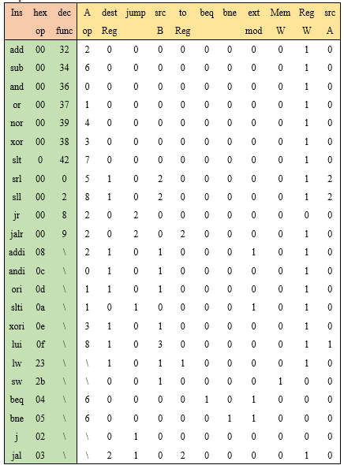
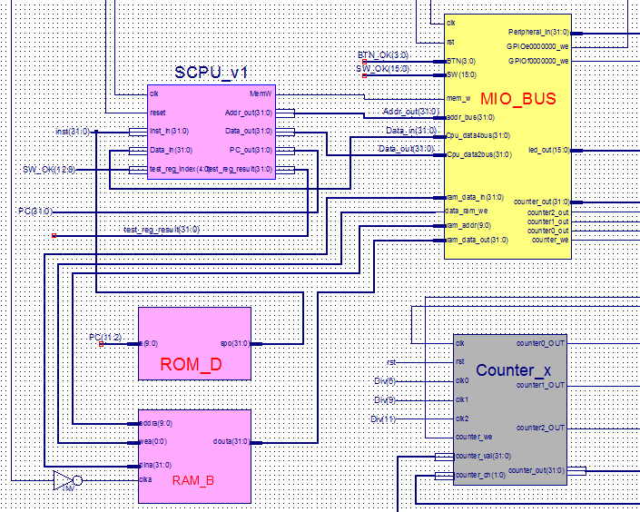

# 1. OVERVIEW
*SingleCycleCPU*, as its name reveals, is a **hardware program** that simulate the behavior of a  trivial **single cycle CPU**.
As a homework assigned in the **computer organization** course for sophomore majoring in CS,
it is an **individual project** for **non-comercial** purposes.  
# 2. TASK INTRODUCTION
1. Design the Datapath, bring together the basic units into Single-cycle clock CPU  
2. Implement at least 9instructions: Add, Sub, And, Or, Lw, Sw, Slt, Beq, J.  
3. Better implement the 16instructions: Add, Sub, And, Or, Addi, Ori, Sll, Srl, Lw, Sw, Slt, Beq, Bne, J, Jal, Jr  
4. Verify the CPU with program and observe the execution of program  
# 3. DESIGN PRINCIPLES
## Circuit diagram of Single-cycle CPU  
Here is the draft of my circuit implementing the CPU:  
  
## Truth table for control signal  
After construction the datapath well, we also need a signal truth table in order to implement controller.  
  
## Interface for SCPU  
Now we can have a look at the interface of my SCPU, and the relationship between the SPCU and its neibours.  
  

# 4. TESTING RESULT
Everything went well in the following four tests:
## LED Banner
  
## Number traversal
  
## Timer
  
## Rectangle change
  

# 5. LICENSE
The content of all the codes are supposed to use a licence [AGPLv3](./LICENSE)  

# 6. HOW TO CONTRIBUTE
1. Learn what is a AGPLv3, if you have not yet done so (see details above).  
2. Create your change to the repo in question.
- Fork the desired repo, develop and test your code changes.
- Ensure that your code is clear and comprehensible.
- Ensure that your code has an appropriate set of unit tests which all pass.
3. Submit a pull request.
4. The repo owner will review your request. If it is approved, the change will be merged. If it needs additional work, 
the repo owner will respond with useful comments.

# 7. CREDIT
First of all, I would like to extend my sincere gratitude to my supervisor, Xiaohong Jiang, her his instructive advice 
and useful suggestions on my learning on couputer organization.   
I am also deeply grateful of Zhe Pan, the TA's help in the completion and assessment of this project.  
High tribute shall be paid to Licheng Guo, whose profound knowledge of CPU and Verilog HDL triggers my inspiration for this brilliant project. 
